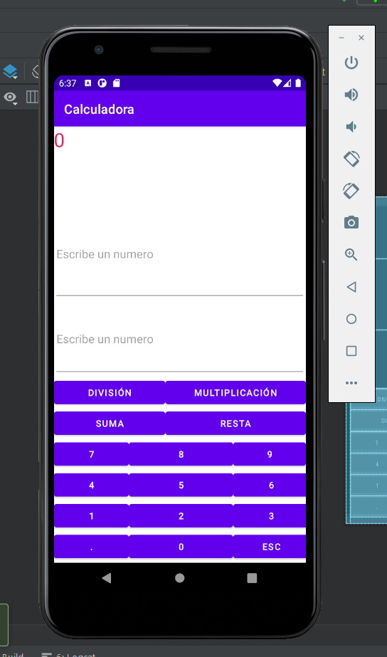
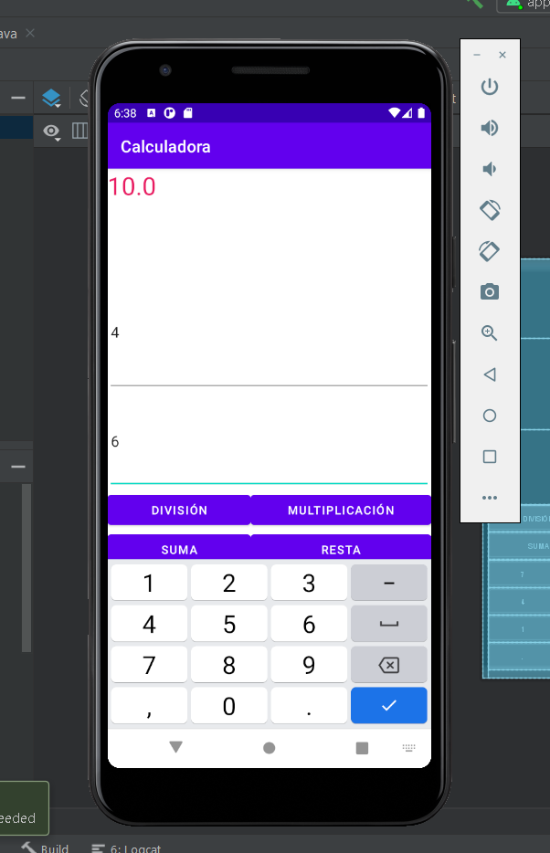
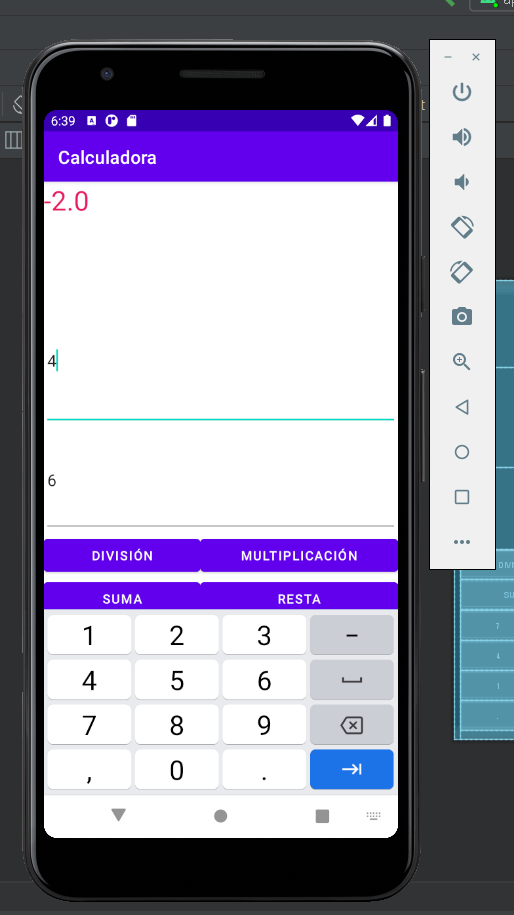
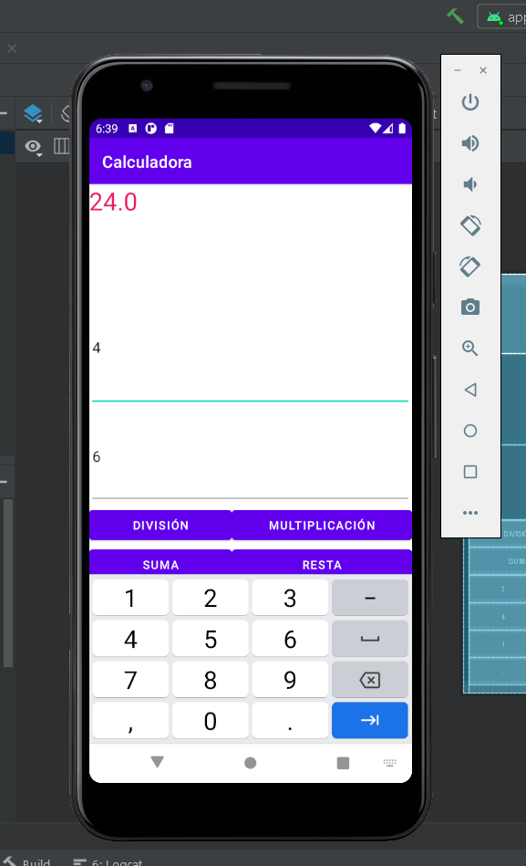

# Calculadora
Calculadora creada por Fabian Matilla en el entorno de Android Studio.

# Preview:
<h3> Diseño </h3>

<h3> Vista Previa </h3>

<h3> Suma </v>

<h3> Resta </h3>

<h3> Multiplicacion </h3>

<h3> Division </h3>


# Utilizacion :

```
Su utilizacion Basica seria introducir dos numeros y el resultado se veria en el textView superior

```
